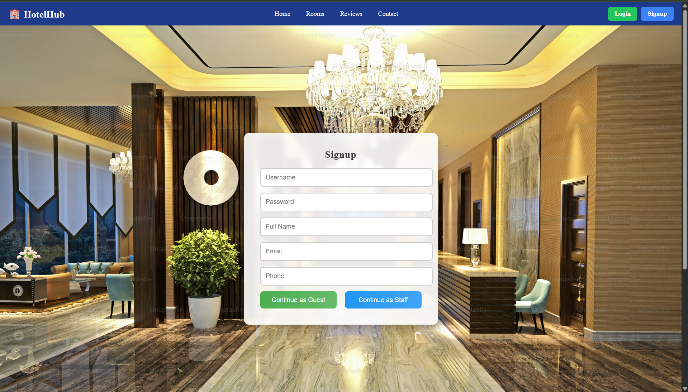
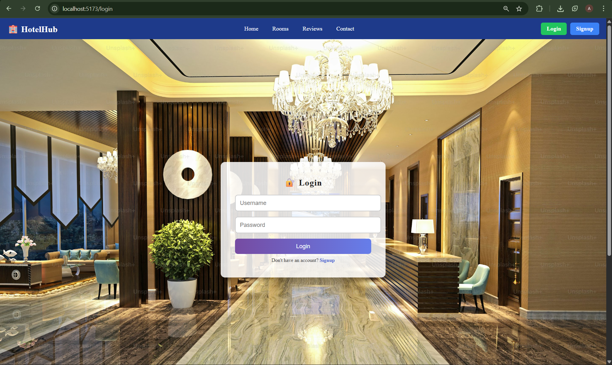
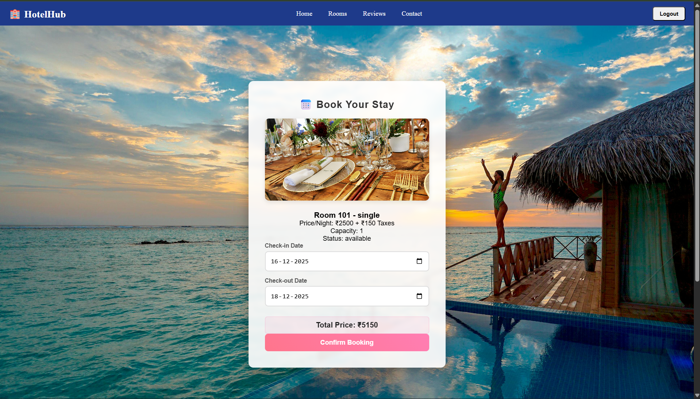
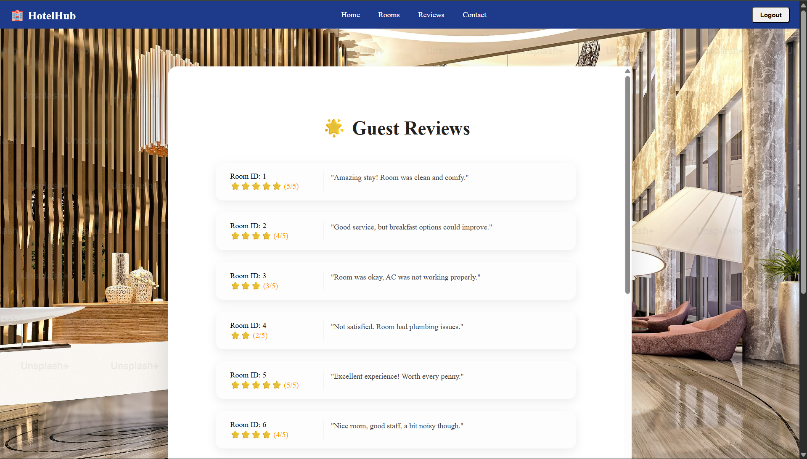

# 🏨 HotelHub – Hotel Management System

HotelHub is a full-stack **Hotel Management System** designed to streamline hotel operations and provide users with a smooth and intuitive booking experience. The platform enables users to register, log in, explore available hotels/rooms, make bookings, and share reviews, all backed by a robust and scalable backend.

This project demonstrates practical implementation of full-stack development concepts, including user authentication, database management, and end-to-end feature integration.

---

## 🚀 Features

- 🔐 **User Authentication**
  - Secure user signup and login
  - Session-based / token-based access flow

- 🏠 **Homepage & Hotel Listings**
  - User-friendly landing page
  - Display of hotel and room information

- 📅 **Room Booking System**
  - Book rooms with selected dates
  - Store booking details in the database

- ⭐ **Reviews & Ratings**
  - Users can submit reviews
  - View feedback from other users

- 🗄️ **Database Integration**
  - Persistent storage of users, bookings, and reviews

---

## 🛠️ Tech Stack

**Frontend**
- HTML
- CSS
- JavaScript

**Backend**
- Node.js
- Express.js

**Database**
- MySQL

---

## 📸 Screenshots

### 🔑 Signup Page



### 🔐 Login Page




### 🏠 Homepage


### 📅 Booking Page




### ⭐ Reviews Page




---

## ⚙️ Installation & Setup

1. **Clone the repository**
```bash
git clone https://github.com/anmol1kush/Hotel-management-system.git
```

2. **Navigate to the project directory**
```bash
cd frontend
cd backend
```

3. **Install dependencies**
```bash
npm install
```

4. **Configure the database**
- Create a MySQL database
- Update database credentials in the project configuration file

5. **Run the server**
```bash
npm start
```

6. Open your browser and visit:
```
http://localhost:3000
```

---

## 📈 Future Enhancements

- 💳 Payment gateway integration
- 🧑‍💼 Admin dashboard for hotel management
- 🏷️ Role-based access (Admin / User)
- 🔒 JWT-based authentication
- 📊 Booking analytics and reports

---

## 👤 Author

**Anmol Kushwaha**  
B.Tech CSE | Full-Stack Developer  
GitHub: https://github.com/anmol1kush

---

⭐ If you like this project, consider giving it a star!

